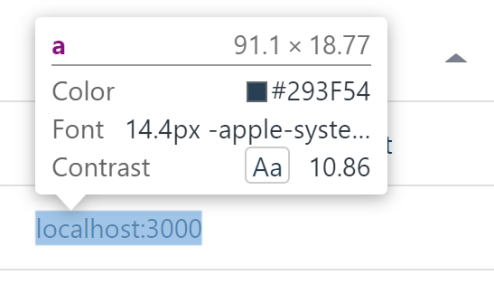

# Administrate::Field::Hyperlink

[](https://travis-ci.com/XPBytes/administrate-field-hyperlink)
[](https://badge.fury.io/rb/administrate-field-hyperlink)
[](http://opensource.org/licenses/MIT)

A string field that is shows a hyperlink.



## Installation

Add this line to your application's Gemfile:

```ruby
gem 'administrate-field-hyperlink'
```

And then execute:

    $ bundle

Or install it yourself as:

    $ gem install administrate-field-hyperlink

## Usage

```ruby
require "administrate/base_dashboard"

class BookDashboard < Administrate::BaseDashboard
  # ATTRIBUTE_TYPES
  # a hash that describes the type of each of the model's fields.
  #
  # Each different type represents an Administrate::Field object,
  # which determines how the attribute is displayed
  # on pages throughout the dashboard.
  ATTRIBUTE_TYPES = {
    id: Field::String,
    name: Field::String,
    author: Field::BelongsTo,
    public_webste: Field::Hyperlink,
    created_at: Field::DateTime,
    updated_at: Field::DateTime
  }.freeze
  
  # ...
end
```

### Options

| option | default | description |
|--------|-------|-------------|
| `scheme` | `https://` |  Scheme to use if there is none given |
| `fallback_href` | nil | `href` to use if the value is `blank?` |
| `label` | `self#href` | The label to use instead of the `href` |

## Related

- [`Administrate`](https://github.com/thoughtbot/administrate): A Rails engine that helps you put together a super-flexible admin dashboard.
- [`Administrate::BaseController`](https://github.com/XPBytes/administrate-base_controller): :stars: A set of application controller improvements.

### Concerns

- [`Administrate::DefaultOrder`](https://github.com/XPBytes/administrate-default_order): :1234: Sets the default order for a resource in a administrate controller.
- [`Administrate::SerializedFields`](https://github.com/XPBytes/administrate-serialized_fields): :ab: Automatically deserialize administrate fields on form submit.

### Fields

- [`Administrate::Field::Code`](https://github.com/XPBytes/administrate-field-code): :pencil: A `text` field that shows code.
- [`Adminisrtate::Field::JsonEditor`](https://github.com/XPBytes/administrate-field-json_editor): :pencil: A `text` field that shows a [JSON editor](https://github.com/josdejong/jsoneditor).
- [`Administrate::Field::LazyBelongsTo`](https://github.com/XPBytes/administrate-field-lazy_belongs_to): :pencil: A `belongs to`-like field that lazily loads candidates from a custom endpoint.
- [`Administrate::Field::ScopedBelongsTo`](https://github.com/XPBytes/administrate-field-scoped_belongs_to): :pencil: A `belongs_to` field that yields itself to the scope `lambda`.
- [`Administrate::Field::ScopedHasMany`](https://github.com/XPBytes/administrate-field-scoped_has_many): :pencil: A `has_many` field that yields itself to the scope `lambda`.
- [`Administrate::Field::TimeAgo`](https://github.com/XPBytes/administrate-field-time_ago): :pencil: A `date_time` field that shows its data as `time_ago` since.

## Development

After checking out the repo, run `bin/setup` to install dependencies. Then, run `rake test` to run the tests. You can
also run `bin/console` for an interactive prompt that will allow you to experiment.

To install this gem onto your local machine, run `bundle exec rake install`. To release a new version, update the
version number in `version.rb`, and then run `bundle exec rake release`, which will create a git tag for the version,
push git commits and tags, and push the `.gem` file to [rubygems.org](https://rubygems.org).

## Contributing

Bug reports and pull requests are welcome on GitHub at [XPBytes/administrate-field-hyperlink](https://github.com/XPBytes/administrate-field-hyperlink).
